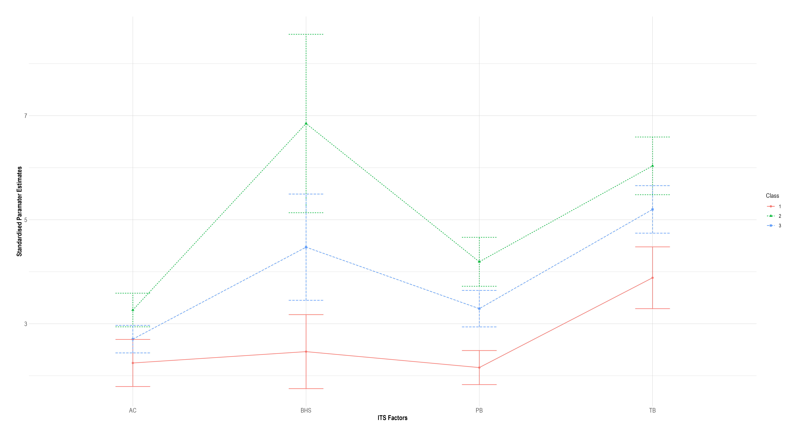

```{r, cleanup, include = FALSE, results = "hide", warning = FALSE}
## setwd
library("here")
## clean the environment
rm(list = ls(all = TRUE))
## load data
list2env(readRDS("./data/proc/lpa_df.rds"), .GlobalEnv)

## load libraries, options, and function
source("./code/func.R")
source("./code/load.R")

## setup default chunk options
opts_chunk$set(
             echo = FALSE,
             message = FALSE,
             warning = FALSE,
             ## set "hide" as default
             results = "hide"
           )

## set knitr and compile options
options(
  knitr.kable.NA = "",
  kableExtra.auto_format = FALSE,
  ## knitr.table.format = "html", # uncomment when kbl dev
  knitr.table.format = ifelse(knitr::pandoc_to("html"), "html", "simple"),
  kableExtra.html.bsTable = TRUE,
  tinytex.verbose = TRUE
)

```


# Introduction {.tabset}

Suicide is the number one cause of death in Australian young people aged 12 to
25-years [Australian Bureau of Statistics [ABS], -@abs2021].
Globally, it is the fourth leading cause of death for 15 to 29-year-olds [WHO,
-@WHO2021].
The Interpersonal Theory of Suicide [ITS, @joiner2005; @vanorden2010] provides a
model for understanding the potential mechanisms leading to suicide that may
help inform treatment.
The ITS posits that the interaction of perceived burdensomeness and thwarted
belongingness lead to suicidal desire.
The intensity of suicidal desire is moderated by feelings of hopelessness about
the likelihood of their current situation improving and is positively correlated
with resoluteness to enact a suicide plan.
Finally, according to the theory, for someone to enact a lethal suicide attempt,
they must have the capability to do so, potentially acquired via painful and
provocative experiences (e.g., trauma, deliberate self-injury) [@vanorden2010].
Although capability is a requisite for suicidal behaviour according to the ITS,
without suicidal desire the relative risk is low.
The theory offers guidance regarding the targets of treatment for people at risk
of suicide and posits that reductions in thwarted belongingness and perceived
burdensomeness should be the aims of psychological interventions [@joiner2009].


From a risk perspective, suicidal ideation is one of the strongest correlates of
a suicide attempt history [@victor2014; ABS,
-@abs2021], and the transition from the onset of suicidal ideation to plan and
then to attempt often happens within the first year [@borges2008; @nock2013;
@nock2008].
A number of other psychosocial factors are commonly associated with suicide,
including deliberate self-injury, mood, anxiety, stress, substance use, and
interpersonal problems [ABS, -@abs2021].
However, the majority of people who experience these risk factors will not go on
to kill themselves [@aihw2021a].
Therefore, the ITS may be helpful in understanding the differences between those
who do and do not transition to suicide attempts and inform their assessment and
treatment.


Evidence supporting the use of the ITS in clinical populations of suicidal young
people is increasing [@hains2019; @horton2015; @king2017; @miller2016].
But overall, findings in support of the clinical application of the theory are
mostly mixed [@ma2016; @chu2017; @stewart2017a].
Clinical opinion suggests that meaningful change over the course of therapy
requires sensitivity to an individual’s presenting issues [@miller2002],
although a criticism of clinical research has been that the majority employed
methods that do not take individual differences into account [@carper2017].
Utilising more idiographic approaches to test clinical research questions could help
improve clinical assessment, conceptualisation, and treatment [@piccirillo2019].
With suicidal young people this is arguably even more important as the stakes
are potentially much higher [@dougherty2009; @liu2017a; @nagra2016;
@albanese2019a; @albanese2019].
Latent Profile Analysis (LPA) provides an avenue for clinical research to
compare subgroups of individuals that share similar patterns on variables within
a population [@berlin2014; @meyer2013].
Identifying latent subgroups could provide insight into the factors that are
associated with variable responses to therapy and help clarify active mechanisms
of psychological interventions [@kazdin2003].
Treatment could then be more effectively tailored for individuals or groups at
highest risk [@lanza2013; @windgassen2018].


Recent research has used LPA within the context of the ITS to explore
relationships between subclasses of people at risk of suicide on [@love2021;
@ma2018; @wong2020].
The potential strength of the ITS, and indeed any theory, is to help to explain
phenomena under investigation.
Further to this, the theory offers validated measures to test the factors
associated with its hypotheses [@vanorden2012; @ribeiro2014; @vanorden2008].
For example the study of @wong2020, which used validated ITS measures
to inform the identification of latent classes in a clinical population
participating in a trial of an online treatment for suicidal behaviours.
This study used burdensomeness, belongingness, and capability to identify three
latent classes.
The study found that class membership was associated with elevated scores on the
ITS interpersonal constructs (perceived burdensomeness, thwarted belongingness),
severity of suicidal ideation and closeness to recent suicide attempt, in
addition increasing severity on a range of other psychological factors,
including hopelessness and depression.
The authors suggest that participants with more severe ITS interpersonal factors
could benefit from interpersonally oriented treatment components.
However, participants were adults and comprised a broad age range, limiting the
applicability of their findings to adolescents [@wong2020].
Moreover, whilst a strength of this study was assessing suicidal ideation over
four timepoints, the study did not test the association of the ITS factors with
suicidal ideation or proximity to suicide over the course of therapy
[@wong2020].
The factors proposed by the ITS to be associated with change in suicidality
(burdensomeness and belongingness) were not tested [@joiner2009], further
limiting conclusions about the underlying mechanisms related to treatment
outcomes, both in regards to testing the ITS and the theory's usefulness for
treatment with adolescents.
Although @ma2018 did test the association of ITS factors with suicidal ideation
across four latent profiles.
The study found partial support for the association of suicidal ideation with
burdensomeness (full sample and class 1), in addition to the interaction between
belongingness and burdensomeness (only class 3).
However, this study use a non-clinical adult sample and only tested the posited
ITS relationships at a single timepoint [@ma2018], again  limiting the
applicability findings to young people in treatment may be limited.
Love and Durtschi's [-@love2021] study partially addressed some of these
limitations, using data from a longitudinal sample of young adults to test the
ITS, where data collection began during participant's adolescence.
Authors found that low belongingness during childhood was associated with
increased risk suicidal ideation during adulthood [@love2021].
However, this study also had several limitations.
Specifically, all ITS factors were assessed using proxy measures provided by a
non-clinical population.
Moreover, only one measure was administered during adolescence (belongingness)
with the remainder of available data taken during adulthood [@love2021].
Therefore, an ITS informed approach to identifying latent classes within a
clinical population of young people a risk of suicide has not yet been
undertaken.


## Aims

This study seeks to advance previous knowledge of the ITS using LPA of young
people seeking treatment for suicide related risk.
It will identify distinct subclassess of young people varying on initial symptom
severity, using factors proposed by the ITS [@joiner2005; @vanorden2010;
@wong2020].
Data from a sample attending a psychological service for suicide prevention in
youth was used.
The latent groups will be compared for differences in demographics, and other factors
associated with suicide and treatment outcomes.
<!-- NOTE h1 -->
Based on the ITS, we hypothesised that the highest levels of mental ill health
symptoms (e.g., suicidal ideation, depression, self-injury), would be found in
groups reporting higher levels of thwarted belongingness, perceived
burdensomeness, hopelessness, and acquired capability.
<!-- NOTE h2 -->
Additionally, across the full sample and the subgroups, we hypothesised that the
ITS factors and the three way-interaction between belongingness, burdensomeness,
and hopelessness would be associated with severity of suicidal ideation over the
course of therapy.
<!-- partially supported -->

# Method {.tabset}


```{r non-binary-n, include = TRUE, results = "hide", warning = FALSE}
.lpa_n_c <-
  lpa_t0 %>%
  filter(session %in% 1 & !is.na(c)) %>%
  mutate(sex = as.character(sex)) %>%
  group_by(c, sex) %>%
  summarise(
    n = n(),
  ) %>%
  ## filter(!is.na(sex)) %>%
  mutate(
    prc = round(n / sum(n, na.rm = TRUE) * 100, 1),
    sex = if_else(is.na(sex), "miss", sex),
    c = as.factor(c)
  )

.lpa_n_tot <-
  lpa_t0 %>%
  filter(session %in% 1, !is.na(c)) %>%
  mutate(sex = as.character(sex)) %>%
  group_by(sex) %>%
  summarise(
    n = n(),
  ) %>%
  ## filter(!is.na(sex)) %>%
  mutate(
    prc = round(n / sum(n, na.rm = TRUE) * 100, 1),
    sex = if_else(is.na(sex), "miss", sex),
    c = as.factor(0), .before = everything()
  )

lpa_n_tot <-
  lpa_t0 %>%
  filter(session == 1 & !is.na(c)) %>%
  mutate(
    atsi = case_when(
      ## correct atsi status from old sp_db
      sp_db %in% "old" & atsi %in% 4 ~ 0,
      ## collapse categories as cell sizes too small
      atsi %in% 0                    ~ 0,
      atsi %in% c(1, 2, 3)           ~ 1,
      TRUE                           ~ NA_real_
    ),
    atsi = as.character(atsi),
    atsi = if_else(is.na(atsi), "miss", atsi)
  ) %>%
  group_by(atsi) %>%
  summarise(
    n = n(),
    c = as.factor("atsi"),
  ) %>%
  mutate(
    prc = round(n/sum(n, na.rm = TRUE)* 100, 1),
  ) %>%
  rename(sex = atsi) %>%
  full_join(.lpa_n_c) %>%
  full_join(.lpa_n_tot) %>%
  select(c, sex, n, prc)

lpa_age <-
  lpa_t0 %>%
  filter(session == 1 & !is.na(c)) %>%
  group_by(sex) %>%
  summarise(
    n = n(),
    age_m = mean(age),
    age_sd = sd(age),
    age_med = median(age),
    age_min = min(age),
    age_max = max(age),
  )

lpa_age <-
  lpa_t0 %>%
  filter(session == 1 & !is.na(c)) %>%
  summarise(
    age_m = mean(age),
    age_sd = sd(age),
    age_mdn = median(age),
    age_min = min(age),
    age_max = max(age),
    ) %>%
  mutate(
    across(
      ends_with(c("_m", "_sd", "_mdn")),
      ~sprintf("%.2f", .x)
      )
  )

lpa_sex_age_diff <-
  lpa_sex_age_diff %>%
  mutate(
    across(
      ends_with("median"),
      ~sprintf("%.2f", .x)
      )
  )

## lpa_eps <-
##   lpa_fin %>%
##   group_by

lpa_refs <-
  lpa_fin %>%
  filter(
    session ==  1,
    !is.na(c)
  ) %>%
  mutate(
    ref = case_when(
      referrer %in% c(1, 2) ~ "GP",
      referrer %in% 3       ~ "MH",
      referrer %in% 4       ~ "ED",
      referrer %in% 5       ~ "psychiatrist",
      referrer %in% 6       ~ "AHP",
      referrer %in% 7       ~ "oth_slf_fam_fr",
      referrer %in% 8       ~ "oth_slf_fam_fr",
      referrer %in% 9       ~ "oth_slf_fam_fr",
      TRUE                  ~ "miss"
    )
  ) %>%
  group_by(ref) %>%
  summarise(
    n = n()
  ) %>%
  mutate(
    prc = paste0(round(n / sum(n) * 100, 1), "%")
    ) %>%
  adorn_totals()


```


```{r, lpa-miss, include = TRUE, results = "hide", warning = FALSE}
## total sample size used for lpa

lpa_miss <-
  ll_si$c3_2_lpa_si2_v1.out

N <-
  lpa_miss$summaries$Observations

## excluded cases
N_excl <-
  max(str_extract(lpa_miss$warnings, "\\d"), na.rm = TRUE) %>%
  as.numeric()

## total sample
N_tot <-
  N + N_excl

## univariate non-missing data
uni_obs <-
  lpa_miss$sampstat$univariate.sample.statistics %>%
  as_tibble() %>%
  janitor::clean_names() %>%
  summarise(
    uni_obs_min = round(min(sample_size) / N * 100, 2),
    uni_obs_max = round(max(sample_size) / N * 100, 2),
  )
uni_obs

## min and max non-missing data for pair of vars
pair_obs_min <-
  round(min(lpa_miss$covariance_coverage, na.rm = TRUE) * 100, 2)
pair_obs_max <-
  round(max(lpa_miss$covariance_coverage, na.rm = TRUE) * 100, 2)
lpa_miss_txt <-
  bind_cols(
    N, uni_obs, pair_obs_min, pair_obs_max, N_excl, N_tot
  ) %>%
    rename(
      N = 1,
      pair_obs_min = 4,
      pair_obs_max = 5,
      N_excl = 6,
      N_tot = 7
    )


lpa_n_excluded <-
  N_excl %>%
  english::english() %>%
  str_to_title()

lpa_n_atsi <-
  lpa_n_tot %>%
  filter(c %in% "atsi", sex %in% "1") %>%
  mutate(
    n = str_to_title(english::english(n)),
    prc = paste0(" people (", prc, "%)")
  ) %>%
  select(n, prc) %>%
  t() %>%
  paste0()

```


Below we report how we determined our sample size, all data exclusions, all
manipulations, and all measures in the study.

## Participants


The study was approved by the institutional Human Research Ethics Committee
(Ethics Number: HE14/376).
The dataset used for this analysis was taken from a naturalistic sample of young
people accessing a short-term outpatient suicide prevention program provided by
a not-for-profit non-government organisation located in the Illawarra Shoalhaven
region of New South Wales, Australia between
`r lpa_t0$date %>% min() %>% ymd() %>% format("%B %d, %Y")` and
`r lpa_t0$date %>% max() %>% ymd() %>% format("%B %d, %Y")`.
The service offered no-fee psychological support for people aged 12--25 years
who were at mild to moderate risk of suicide-related behaviour, including
experiencing nonsuicidal self-injury and suicidal ideation at the time of
referral to the program.
In the current sample, the majority of referrals were from primary care settings
such as general practitioners
(`r subset(lpa_refs, ref %in% "GP", prc)`)
public mental health services
(`r subset(lpa_refs, ref %in% "MH", prc)`)
or emergency departments
(`r subset(lpa_refs, ref %in% "ED", prc)`).
A further
`r subset(lpa_refs, ref %in% "AHP", prc)`
came from allied health professionals and
`r subset(lpa_refs, ref %in% "oth_slf_fam_fr", prc)`
from other referral sources including self, family and friends.
The remainder of participants
(`r subset(lpa_refs, ref %in% "miss", prc)`)
did not have source of referral information available.
Although clinicians were able to draw on different approaches in their clinical
work [@janackovski2021], the main treatment approach used was based on a
cognitive behavioural therapy framework tailored for suicide prevention
[@stanley2009].
All participants provided informed consent to have their clinical information
entered into a research databank, with parental/carer co-consent sought for
participants aged 12--14 years.
Not consenting to research participation did not change the treatment offered.
We limited our analyses of individual therapy outcomes to participants who
reported suicidal ideation at admission and for whom this was their first
episode of treatment.
Participants were included if they had at least two sessions of data recorded.
A session was considered a ‘final session’ if it was recorded as a ‘planned
final session’ in the databank or if there was no contact for more than 90 days
since their last session.
Clients who had not attended therapy for three months were considered to be
completed or dropped out of therapy.
This approach has been used in other studies using naturalistic data [e.g.,
@baldwin2009; @owen2015a].
Unfortunately, we did not have participants' or therapists' ratings of how
therapy ended or why a 'final session' was or was not marked as a 'planned final
session' (e.g., dropout, mutual decision, data entry omission).
A total of
`r N_tot`
participants provided consent to participate in the study.
There were
`r lpa_consenters$n[lpa_consenters$consent %in% "0"]`
clients who declined participation in the study, and
`r lpa_consenters$n[lpa_consenters$consent %in% NA]`
who had missing consent (and could not be included).
Due to privacy restrictions, no further information is available about these
clients.
`r lpa_n_excluded`
participants were excluded due to missing data (explained further below),
providing a final sample of
`r sum(lpa_n_tot$n[lpa_n_tot$c %in% "0"])`
(`r lpa_n_tot$prc[lpa_n_tot$c %in% "0" & lpa_n_tot$sex %in% "0"]`% females,
`r lpa_n_tot$prc[lpa_n_tot$c %in% "0" & lpa_n_tot$sex %in% "1"]`% males,
`r lpa_n_tot$prc[lpa_n_tot$c == "0" & lpa_n_tot$sex == "2"]`% non-binary,
and
`r lpa_n_tot$prc[lpa_n_tot$c == "0" & lpa_n_tot$sex == "miss"]`%
had missing data on gender).
`r lpa_n_atsi`
identified as First Nations Australians.
The average age of the sample was
`r lpa_age$age_m` years
(*SD* = `r lpa_age$age_sd`,
*Mdn* = `r lpa_age$age_mdn`).
Females
(*M* = `r subset(lpa_sex_age_diff, sex %in% 0, age_mean)`,
*SD* = `r subset(lpa_sex_age_diff, sex %in% 0, age_sd)`,
*Mdn* = `r subset(lpa_sex_age_diff, sex %in% 0, age_median)`)
were significantly younger than males
(*M* = `r subset(lpa_sex_age_diff, sex %in% 1, age_mean)`,
*SD* = `r subset(lpa_sex_age_diff, sex %in% 1, age_sd)`,
*Mdn* = `r subset(lpa_sex_age_diff, sex %in% 1, age_median)`,
t[`r sprintf("%.0f", sltb_age_sex_t$dfs)`] =
`r sprintf("%.2f", round(sltb_age_sex_t$t.value[1,1], 2))`,
<!-- look at the p.value if you need to chenck this -->
*p* < .001).

## Measures

All measures were administered via self-report at each session of treatment
unless otherwise specified.

*Interpersonal Needs Questionnaire (INQ)*.
The 15-item INQ [@vanorden2012] assesses perceived burdensomeness (PB, 6-items)
and thwarted belongingness (TB, 9-items), the two interpersonal constructs of
the ITS.
Items are rated on a 7-point Likert scale with higher scores indicating higher
severity.
The measure has been found to be a reliable and valid measure in adolescent
inpatient samples and young adults [@hill2014a; @horton2015].
The internal consistency for the current sample was $\alpha$ =
`r str_remove(round(meas_rel$pb_rel$total$std.alpha, 2), "^0")`
for burdensomeness items, and $\alpha$ =
`r str_remove(sprintf("%.2f", meas_rel$tb_rel$total$std.alpha), "^0")`
for belongingness items.


*Beck Hopelessness Scale (BHS)*.
The BHS [@beck1974] measures symptoms of hopelessness over the past week.
However, the service changed from using the original 20 item true/false scale
[true = 1 and false = 0, @beck1974] to the short 4-item version during the data
collection period.
The latter comprised items 6, 7, 9, and 15 of the original, with a 6-point Likert
scale [@aish2001; @yip2006].
In order to use data from both versions for analysis, the short-form version had
responses rescaled to 0--5, and then summed, providing scores that fell into the
same 0 to 20 range as the full-scale version.
In both cases, higher scores indicate higher severity.
Both versions have previously demonstrated strong internal reliability
[@beck1998].
The internal consistency for the current sample was $\alpha$ =
`r str_remove(round(meas_rel$bhs_20_rel$total$std.alpha, 2), "^0")`
for the 20-item version, and $\alpha$ =
`r str_remove(round(meas_rel$bhs_sf_rel$total$std.alpha, 2), "^0")`
for the 4-item version.


*Acquired Capability for Suicide Scale-Fearlessness About Death (ACSS-FAD)*.
The 7-item ACSS-FAD [@ribeiro2014; @vanorden2008] measured capability for
suicide at baseline.
Items are rated on a 5-point Likert scale.
Higher scores indicate higher fearlessness about death [@vanorden2008].
Discriminant validity is evidenced by the non-significant relationship with
suicidal desire and depression [@vanorden2010].
The ACSS-FAD has demonstrated good internal consistency amongst clinical samples
of adolescents [@horton2015], and was satisfactory in the current sample
($\alpha$ =
`r str_remove(sprintf("%.2f", meas_rel$ac_rel$total$std.alpha), "^0")`).


*Modified Scale for Suicidal Ideation (MSSI)*.
The MSSI [@miller1986] is a clinician-administered 18-item semi-structured
interview used to measure severity of suicidality for the 48 hours leading up to
the point of interview.
The scale consists of two factors: Suicidal Desire and Ideation (SDI) and
Resolved Plans and Preparations (RPP) [@joiner1997].
The first four questions are designed as screening items to identify those whose
suicidal ideation is severe enough to warrant administration of the entire scale
[@miller1986].[^10]
The MSSI has demonstrated high internal reliability in adult psychiatric
inpatient samples [@miller1986] and inpatient suicidal youth, with high
interrater reliability on the total scores [@pettit2009].
The internal consistency of the MSSI in the current sample $\alpha$ =
`r str_remove(round(meas_rel$si_rel_4$total$std.alpha, 2), "^0")`
for the screening items and $\alpha$ =
`r str_remove(round(meas_rel$si_rel$total$std.alpha, 2), "^0")`
for the full scale.


*Depression Anxiety and Stress Scale–short version (DASS21)*.
The DASS21 [@lovibond1995a] measures symptoms of depression, anxiety, and
stress over the past week.
Items are rated on a 4-point Likert scale with higher scores indicating higher
symptom severity.
Strong internal reliability has been demonstrated in non-clinical samples of
young people [@klonsky2009; @szabo2010], comparable to studies of adult clinical
and community samples [@antony1998].
Internal consistency of the DASS21 in the current sample $\alpha$ =
`r str_remove(round(meas_rel$dep_rel$total$std.alpha, 2), "^0")`
for depression, $\alpha$ =
`r str_remove(round(meas_rel$anx_rel$total$std.alpha, 2), "^0")`
for anxiety, $\alpha$ =
`r str_remove(round(meas_rel$str_rel$total$std.alpha, 2), "^0")`
for stress.


*Inventory of Statements about Self-injury (ISAS)*.
The ISAS [@klonsky2009; @klonsky2008] is a two-part measure implemented to
evaluate the methods, history, and functions of NSSI at baseline.
The first section assesses lifetime frequency of 12 self-injury methods, the age
of initial and most recent episodes of self-injury, the experience of pain,
whether behaviours occur in isolation or around others, the time between urge
and action of behaviours, and whether the individual wishes to stop
self-injurious behaviours.
The second section of the ISAS contains 39 items used to measure thirteen
intrapersonal and interpersonal functions of self-injury.
Items are rated on a 3-point Likert scale.
Higher scores on these subscales indicate stronger endorsement of the functions
for the participant.
Within the thirteen functions, five load intrapersonally and eight
interpersonally [@klonsky2009].
The ISAS has good test-retest reliability [@glenn2011] and construct validity
demonstrated in a clinical sample  [@klonsky2015a].
Reliability for ISAS section 2 was $\alpha$ =
`r str_remove(sprintf("%.2f", meas_rel$isas_social_rel$total$std.alpha), "^0")`
for interpersonal and
$\alpha$ =
`r str_remove(round(meas_rel$isas_intra_rel$total$std.alpha, 2), "^0")`
for intrapersonal subscales.


*Single Item Suicide Scale (SISS)*.
The SISS is a single item questionnaire developed by the suicide prevention
program that assesses the severity of suicidal thoughts and behaviours
(ideation, plans, intentions, or attempts) over the previous week along a
6-point Likert scale. [^2]


*Demographics*.
During participants' initial session, treating clinicians also collected data on
demographic and background factors.
This included ethnicity, income status, relationship status, living
arrangements, and history of previous psychological treatment and personal
trauma.
Finally, data on whether participants had experienced deliberate self-injury,
suicidal ideation, or suicidal thoughts prior to their current episode of care
was also recorded.


## Plan of analysis

<!-- TODO include additional r lib refs in final thesis -->

Unless otherwise specified, all data preparation, analysis, and plots were
carried out using R [version 4, @rcoreteam2021].
Latent Profile Analysis (LPA) using Mplus [version 8.6, @muthen2017] via the R
interface 'MplusAutomation' [@hallquist2018] was performed to identify distinct
classes based on the four predictors of suicide risk posited by the ITS
[perceived burdensomeness, thwarted belongingness, hopelessness, and acquired
capability, @joiner2005; @vanorden2010].
To identify the best fitting model for the data, the VuongLo-Medell-Rubin
Likelihood Ratio test [VLMR-LRT, @lo2001] was compared alongside the Bayesian
Information Criterion (BIC) and entropy values.
As there was no prior hypothesis on the exact number of profile groups from the
data, the analysis was conducted starting with a two profile model, increasing
the number of profiles until the VLMR-LRT became non-significant
[@asparouhov2012].


Multinomial regression analysis using 'mlogit' [@croissant2020], chi-square, and
univariate analysis of variance tested differences across classes for
demographic, treatment related variables, and lifetime prevalence of suicide
related factors.
Generalised linear mixed models (GLMMs) using 'glmmTMB' [@brooks2017] tested the
association between the ITS factors and suicidal ideation over the course of
therapy (using data from participants' admission and final session), taking into
account the random effect of session.
Separate GLMMs were carried out on the full sample and for each class.
Depression, gender, age, and number of sessions were also included in the model.
A "dummy" covariate indicating whether each client's final session was planned
was created and used in the GLMMs.
Overdispersion in the suicide ideation outcome variable was checked using the
'DHARMa' package [@hartig2022].
As suicidal ideation displayed overdispersion, analyses and subanalyses with the
full sample  by class respectively, were fitted to negative binomial error
distributions with a log linear parameterization link function.
Due to convergence warnings provided by the software, the ITS variables were
standardised.


### Missing data

For the MSSI, given that data was missing for participants that did not warrant
the full administration of the measure, but to respect the potential missing data
not related to this administration procedure, manual imputation was carried out
to be able to compare participants on a uniform scale.
The logic used was: if items 5 to 18 were missing and the screening items were
below cut-off (i.e., indicated administration should be ceased) and had no items
missing, replace missing data on items 5 to 18 with 0, otherwise treat as
missing.
For all other continuous measures, where there was 20% or less missing items for
a scale, the scale was prorated.
For the LPA, participants were removed if they had missing data on all variables
used to specify the LPA
(*n* = `r lpa_miss_txt$N_excl`,
`r round(lpa_miss_txt$N_excl / lpa_miss_txt$N_tot * 100, 2)`%
of total sample).
For the LPA, multinomial, and multilevel regression analyses, missing data was
handled with full information maximum likelihood estimation [@croissant2020;
@brooks2017; @muthen2017; @yuan2000], for all other analyses participants with
missing data on a particular variable were omitted [@rcoreteam2021].


# Results {.tabset}


```{r unlist-dfs, include = FALSE, results = "hide", warning = FALSE}
lpa_sample <-
  lpa_sample$mis

lpa_anova <-
  lpa_anova_fx_mes$mis

```

## Latent Profile Analysis

Fit statistics for models that contained between two and four classes were
compared.[^11]
The findings indicate that, although the loglikelihood reduced with the increase
in classes, the three-class solution had an improved model fit compared with the
preceding model as reflected by the significant V-LMR value [@nylund2007].
Classes are show in Figure \@ref(fig:lpa-fig).
Further, the four-class solution did not yield a significant V-LMR *p*-value at
*p* < .001, and the four-class solution was not distinctively different from the
three-class solution.
Therefore, the three-class model was deemed to provide the most parsimonious
solution.

Table \@ref(tab:fu-tab) shows that the mean scores significantly differed across
all ITS domains between the three classes.
The first class had the lowest scores across all four domains.
There were
`r lpa_sample[lpa_sample$c %in% 1, "N"]`
(`r round(lpa_sample[lpa_sample$c %in% 1, "prc"], 2)`%)
individuals in this class, which was termed *motivated-situational*.[^8]
The highest standardised score reported by this class was for the  belongingness
indicator.
The second class had the largest sample size and the highest scores across all
four domains.
This class was termed *complex-avoidant* and had
`r lpa_sample[lpa_sample$c %in% 2, "N"]`
(`r round(lpa_sample[lpa_sample$c %in% 2, "prc"], 2)`%)
individuals.
The highest standardised score for this class was for the hopelessness measure.
The third class had mid-range domain scores and was termed *interpersonal-ideator*.
This class had the second largest sample size of
`r lpa_sample[lpa_sample$c %in% 3, "N"]`
(`r round(lpa_sample[lpa_sample$c %in% 3, "prc"], 2)`%)
individuals in this class, and reported higher total scores than the first
class, but lower scores than the second class.
The highest standardised score reported by this class was also the belongingness
indicator.
The effect size for differences in perceived burdensomeness, thwarted
belongingness, and hopelessness between classes was large [@cohen1992].
With regard to both burdensomeness and belongingness, the
*motivated-situational* class had a mean more than two standard deviations
smaller than *complex-avoidant*
(*d* = `r paste0(t(subset(lpa_anova, var %in% c("pb", "tb"), d_1v2)), collapse = ", ")`,
*p* < .001, respectively)
and more than one standard deviations lower than the *interpersonal-ideator* class
(*d* = `r paste0(t(subset(lpa_anova, var %in% c("pb", "tb"), d_1v3)), collapse = ", ")`,
*p* < .001, respectively).
The *complex-avoidant* class had a mean almost one standard deviation
higher than the *interpersonal-ideator* class
(*d* = `r paste0(t(subset(lpa_anova, var %in% c("pb", "tb"), d_2v3)), collapse = ", ")`,
*p* < .001, respectively).
The *complex-avoidant* class had a mean more than two standard deviations
higher than the *interpersonal-ideator* class
(*d* = `r subset(lpa_anova, var %in% "bhs", d_2v3)`, *p* < .001).
Regarding hopelessness, the *motivated-situational* class had a mean more than
five standard deviations smaller than *complex-avoidant*
(*d* = `r paste0(subset(lpa_anova, var %in% "bhs", d_1v2))`,
*p* < .001, respectively)
and more than two standard deviations lower than the *interpersonal-ideator* class
(*d* = `r paste0(subset(lpa_anova, var %in% "bhs", d_1v3))`,
*p* < .001, respectively).
The *complex-avoidant* class had a mean more than two standard deviations
higher than the *interpersonal-ideator* class
(*d* = `r subset(lpa_anova, var %in% "bhs", d_2v3)`, *p* < .001).
Regarding acquired capability, the *motivated-situational* class mean, more than
one standard deviation smaller than *complex-avoidant*
(*d* = `r paste0(subset(lpa_anova, var %in% "ac", d_1v2))`,
*p* < .001), with a large effect size,
and less than half a standard deviation lower than the *interpersonal-ideator*
class
(*d* = `r paste0(subset(lpa_anova, var %in% "ac", d_1v3))`,
*p* < .001), with a small effect size.
The *complex-avoidant* class had a mean more than half a standard deviation
higher than the *interpersonal-ideator* class
(*d* = `r subset(lpa_anova, var %in% "ac", d_2v3)`, *p* < .001), with a medium
effect size.


## Descriptive analysis: suicidality class comparisons

Table \@ref(tab:fu-tab) also contains descriptive analyses of demographic,
treatment related, psychological distress, deliberate self-injury, and suicide
related variables available at baseline.

*Demographic Variables*.
There were significant differences in education and employment status, where the
*interpersonal-ideator* class was significantly more likely to report working
(`r subset(fu_test, var %in% "income" & value %in% "working", m_3)`%)
whereas *complex-avoidant* was significantly less likely
(`r subset(fu_test, var %in% "income" & value %in% "working", m_2)`%).
No other Chi square and ANOVA analyses showed significant differences between
classes on age, gender, living arrangements, cultural background, or
relationship status.

*Treatment Related Variables*.
There was no difference between classes on whether participants had engaged in
psychological therapy prior to engaging with the service, the number of sessions
attended in their current episode, or whether their final session for current
episode was 'planned'.

*Psychological Distress*.
Symptoms of anxiety, depression, and stress were significantly higher in the
*complex-avoidant* class,
(*m* = `r paste(t(subset(fu_test, value %in% c("anx", "dep", "str"), select = m_2)), collapse = ", ")`),
followed by the *interpersonal-ideator* class
(*m* = `r paste(t(subset(fu_test, value %in% c("anx", "dep", "str"), select = m_3)), collapse = ", ")`),
and the *motivated-situational* class
(*m* = `r paste(t(subset(fu_test, value %in% c("anx", "dep", "str"), select = m_1)), collapse = ", ")`).
Although symptoms of anxiety were not significantly different between the *complex-avoidant*
and *interpersonal-ideator* classes.

*Deliberate Self-Injury*.
Participants in the *motivated-situational* class were significantly less likely to report
a history of deliberate self-injury
(`r subset(fu_test, var %in% "hxdsh" & value %in% "yes", select = m_1)`%)
compared to *complex-avoidant*
(`r subset(fu_test, var %in% "hxdsh" & value %in% "yes", select = m_2)`%)
and *interpersonal-ideator*
(`r subset(fu_test, var %in% "hxdsh" & value %in% "yes", select = m_3)`%).
*Complex-avoidant* and *interpersonal-ideator* age of onset
(*m* = `r paste0(subset(fu_test, value %in% "dsh_age_onset", c(m_2, m_3)), collapse = ", ")`
respectively) was younger compared to *motivated-situational*
(*m* = `r paste0(subset(fu_test, value %in% "dsh_age_onset", m_1))`).
The functions of self-injury also differed between the classes.
The *complex-avoidant* class endorsed significantly more methods of self-injury
(*m* = `r subset(fu_test, value %in% "dsh_n", select = m_2)`)
than the *motivated-situational*
(*m* = `r subset(fu_test, value %in% "dsh_n", select = m_1)`)
and *interpersonal-ideator*
(*m* = `r subset(fu_test, value %in% "dsh_n", select = m_3)`)
classes, and the methods endorsed were more severe (cutting and interfering with
wounds).
Respectively, self-injury for intrapersonal reasons, and in particular to stop
disassociation and reduce suicidal desire were significantly higher in the *high
suicidality* class
(*m* = `r paste(t(subset(fu_test, value %in% c("isas_intra", "is_ant_dis", "is_ant_sui"), select = m_2)), collapse = ", ")`)
than both the *motivated-situational*
(*m* = `r paste(t(subset(fu_test, value %in% c("isas_intra", "is_ant_dis", "is_ant_sui"), select = m_1)), collapse = ", ")`)
and *interpersonal-ideator*
(*m* = `r paste(t(subset(fu_test, value %in% c("isas_intra", "is_ant_dis", "is_ant_sui"), select = m_3)), collapse = ", ")`)
classes.
Additionally, the *complex-avoidant* class was more likely to endorse affect
regulation
(*m* = `r subset(fu_test, value %in% "is_aff_reg", select = m_2)`)
than *interpersonal-ideator*
(*m* = `r subset(fu_test, value %in% "is_aff_reg", select = m_3)`)
as a reason for their self-injury.
Whereas *interpersonal-ideator* were significantly more likely to endorse peer
bonding and interpersonal influence respectively as reasons for self-injury
(*m* = `r paste(t(subset(fu_test, value %in% c("is_int_inf", "is_peer_bnd"), select = m_3)), collapse = ", ")`)
compared to *complex-avoidant*
(*m* = `r paste(t(subset(fu_test, value %in% c("is_int_inf", "is_peer_bnd"), select = m_2)), collapse = ", ")`).
The *motivated-situational* class was also more likely to want to stop self-injurious
behaviours
(`r subset(fu_test, var %in% "dsh_want_stop" & value %in% "yes", select = m_1)`%),
whereas the *complex-avoidant* class was more ambivalent
(`r subset(fu_test, var %in% "dsh_want_stop" & value %in% "sometimes", select = m_2)`%).
The *interpersonal-ideator* class were significantly less likely to report
self-injuring alone than the other classes
(`r subset(fu_test, var %in% "dsh_alone" & value %in% "yes", select = m_3)`%).
There were no differences between classes endorsing interpersonal functions, the
experience of pain, days since previous self-injury, or the duration between the
urge and action of self-injury.[^4]

*Suicide Related Variables*.
Chi square analysis showed participant in the *motivated-situational* class were
significantly less likely to have a history of suicidal ideation prior to the
current treatment episode
(`r subset(fu_test, var %in% "hxsuicide" & value %in% "yes", select = m_1)`%).
Whereas those in the *interpersonal-ideator* class were more likely to endorse
vague suicidal thoughts
(`r subset(fu_test, value %in% "si_vague", m_3)`%)
Suicidal ideation was significantly more severe in the *complex-avoidant* class
(*m* = `r subset(fu_test, value %in% "si", select = m_2)`),
followed by the *interpersonal-ideator* class
(*m* = `r subset(fu_test, value %in% "si", select = m_3)`),
and the *motivated-situational* class.
There were no differences in trauma or previous history of suicide attempts.


## Multinomial logistic regression

Table \@ref(tab:fu-ml) show the results of multinomial regression analysis with
class as the dependent variable and demographic, psychological distress,
deliberate self-injury, suicide and treatment related variables as predictors.
<!-- demo -->
For each standard deviation increase in age, there was higher odds
(`r sprintf("%.2f", subset(fu_ml, name %in% "age", exp_b_2v1))`)
of being in the *motivated-situational* than the *complex-avoidant* class.
Individuals in *interpersonal-ideator*
(`r sprintf("%.2f", subset(fu_ml, name %in% "atsiATSI", exp_b_2v3))`)
had higher odds of identifying as being of First Nations Australians background
than the *complex-avoidant* class.
<!-- distress -->
Regarding psychological distress, for each standard deviation increase in
depression severity, those in the *motivated-situational*
(`r subset(fu_ml, name %in% "dep", exp_b_2v1)`)
and the *interpersonal-ideator*
(`r subset(fu_ml, name %in% "dep", exp_b_2v3)`)
classes had lower odds of being in *complex-avoidant*.
This was consistent when comparing the *motivated-situational*
(`r subset(fu_ml, name %in% "dep", exp_b_3v1)`)
to the *interpersonal-ideator*.
<!-- self-injruy -->
In terms of self-injury, the *interpersonal-ideator* class
(`r sprintf("%.2f", subset(fu_ml, name %in% "dsh_aloneno", exp_b_2v3))`)
had higher odds of not being alone when engaging in self-injurious behaviours
than *complex-avoidant*.
Whereas *motivated-situational*
(`r sprintf("%.2f", subset(fu_ml, name %in% "dsh_stopyes", exp_b_2v1))`)
had higher odds of wanting to stop self-injurious behaviours than the
*complex-avoidant*.
For each standard deviation increase in the number of methods of self-injury
endorsed, there was lower odds of being in the *motivated-situational* class
(`r subset(fu_ml, name %in% "dsh_n", exp_b_2v1)`)
compared to *complex-avoidant*.
Additionally, both *motivated-situational*
(`r subset(fu_ml, name %in% "isas_social", exp_b_2v1)`)
and the *interpersonal-ideator*
(`r subset(fu_ml, name %in% "isas_social", exp_b_2v3)`)
had greater odds of endorsing interpersonal reasons for self-injury.
Whereas the *interpersonal-ideator*
(`r subset(fu_ml, name %in% "isas_intra", exp_b_2v3)`)
had lower odds of endorsing intrapersonal reasons for self-injury compared to
the *complex-avoidant* class.
<!-- suicide -->
Finally, for each standard deviation increase in severity of suicidal ideation,
those in the *interpersonal-ideator*
(`r subset(fu_ml, name %in% "si", exp_b_2v3)`)
had lower odds of being in the *complex-avoidant*.


## Multilevel regression


```{r p-value, include = TRUE, results = "hide", warning = FALSE}

.lpa_out_ipt_all <- glm_c_split$mis
.lpa_out_ipt_all$full <- glm_all$mis

lpa_out_ipt_all <-
  .lpa_out_ipt_all %>%
  map(
    ~.x %>%
      tidy(conf.int = TRUE, exponentiate = TRUE) %>%
      clean_names()
  ) %>%
  bind_rows(.id = "var")


mlr_print <-
  lpa_out_ipt_all %>%
  mutate(
    p_print = case_when(
        round(p_value, 2) <= 0.05  ~ "*p* < .05",
        round(p_value, 2) <= 0.01  ~ "*p* < .01",
        round(p_value, 3) <= 0.001 ~ "*p* < .001",
        TRUE ~ paste0("*p* =", str_remove(sprintf("%.2f", p_value), "^0"))
    )
  ) %>%
  select(var, term, p_print)

rci_print <-
  rci_kbl %>%
  mutate(
    across(
      starts_with("p_value"),
      ~case_when(
        round(.x, 2) <= 0.05  ~ "*p* < .05",
        round(.x, 2) <= 0.01  ~ "*p* < .01",
        round(.x, 3) <= 0.001 ~ "*p* < .001",
        TRUE ~ paste0("*p* =", str_remove(sprintf("%.2f", .x), "^0"))
      ),
      .names = "{.col}_p_print"
    )
  ) %>%
  select(var, c, ends_with("p_print")) %>%
  rename_with(~str_remove(.x, "p_value_"), ends_with("p_print"))

```


The multilevel regression model for factors predicting suicidal ideation within
sessions is shown in Table \@ref(tab:lpa-out).
Results for the full sample show that symptoms of perceived burdensomeness
(`r subset(mlr_print, var %in% "full" & term %in% "pb_z", p_print)`)
and depression
(`r subset(mlr_print, var %in% "full" & term %in% "dep", p_print)`)
were significant predictors after controlling for age, gender, total number of
sessions attended, and whether the participant's final session was 'planned'.
Baseline acquired capability was also significant
(`r subset(mlr_print, var %in% "full" & term %in% "ac_z", p_print)`).
Subanalyses per class show that only depression was significant for the *low
suicidality*
(`r subset(mlr_print, var %in% "c1" & term %in% "dep", p_print)`)
and *complex-avoidant* classes
(`r subset(mlr_print, var %in% "c2" & term %in% "dep", p_print)`).
Whereas for the *interpersonal-ideator* class, baseline acquired capability
(`r subset(mlr_print, var %in% "c3" & term %in% "ac_z", p_print)`)
and being female
(`r subset(mlr_print, var %in% "c3" & term %in% "sex1", p_print)`)
were significant.
Additionally, significant two-way interaction effects between belongingness and
capability
(`r subset(mlr_print, var %in% "c3" & term %in% "tb_z:ac_z", p_print)`)
and three-way interaction effect between burdensomeness, belongingness, and
hopelessness
(`r subset(mlr_print, var %in% "c3" & term %in% "pb_z:tb_z:bhs_z", p_print)`)
were found.


# Discussion {.tabset}

## Main Findings


This analysis provides the first in-depth examination of distinct patterns of
suicide related behaviours among young people engaging in outpatient
psychological interventions for suicide prevention.
The findings of the study support the existence of three distinct classes: (1)
*motivated-situational* (2) *complex-avoidant* and (3)
*interpersonal-ideator*.
The groups differed significantly on all factors of the ITS: perceived
burdensomeness, thwarted belongingness, hopelessness, and acquired capability
[@vanorden2010].
The number of subgroups in our findings are consistent with recent
investigations into latent profiles of suicidal individuals that tend to find
three groups using varying on factors associated with suicide [@wong2020;
@weintraub2020; @bertuccio2021; @love2021; @xiao2021].

<!-- NOTE h1 -->
Our first hypothesis was supported.
Higher severity of mental ill health symptoms was found in groups reporting
higher levels of ITS factors.
The profile with the smallest number of individuals was *motivated-situational*,
characterised by comparatively lower scores across ITS factors and could be
considered clinically less complex.
Based on the standardised ITS factors, belongingness was the strongest factor
compared to other variables within this class.
No demographic or treatment related differences were found between this class
and the other classes.
However, overall this class had lower severity across a range of psychological
distress related factors.
In particular, they reported lower levels of depressive symptoms which were
predictive of being members of this class.
Additionally, they were less likely to have a previous history of self-injury or
suicidal ideation prior to their current episode of treatment.
Although across the classes, intrapersonal functions for self-injury were
generally more endorsed than interpersonal functions, compared to
*complex-avoidant*, class members of the *motivated-situational* class were
more likely to endorse interpersonal functions for self-injury and more likely
to want to stop these behaviours.
This may indicate that they were particularly receptive to help.
Additionally, they had significantly lower scores on suicidal ideation than the
*complex-avoidant* class.
There was no significant differences between the *motivated-situational* and
*interpersonal-ideator* classes on suicidal ideation.
Together these results are consistent with propositions of the ITS whereby
intensity of ITS factors are associated with severity of suicide desire
[@vanorden2010].
Those in the motivated-situational group are likely experiencing situational
stressors and while interpersonal difficulties were potentially a contributing
factor to their suicidal risk, given their scores on the ITS factors, this class
may generally be more connected to supportive others and interested in receiving
help [@ballard2015; @glenn2019; @pineda2013].


At the other extreme, *complex-avoidant*, the largest profile, had the
highest scores across all ITS factors, in particular hopelessness.
They reported elevated scores across several factors associated with suicide
risk and had a higher level of clinical complexity.
This pattern of findings is consistent with previous research based on ITS
factors [@wong2020; @vanorden2010].
Their age of onset of self-injury was significantly younger compared to
the *motivated-situational* class, and the frequency and severity of
self-injury was higher than both the other classes.
Moreover, they were more likely to endorse intrapersonal functions of
self-injury, which has been associated with greater suicidal behaviours
[@nock2005].
Considering their higher psychological distress and significantly higher
endorsement of intrapersonal functions of self-injury, the intensity of their
psychological experiences may lead this group to overwhelming affective arousal
and self-blame.
This may contribute to the use of self-injury to punish themselves and combat
disassociation.
Although the ongoing use of self-injury potentially increases their risk of
suicide via continued exposure to painful and provocative events
[@vanorden2010], this group was more likely to engage in these behaviours to
deescalate their suicidality.
The inference is that participants in this group potentially perceive
self-injury as a way to keep them connected to reality and stop from killing
themselves [@miller2021; @straiton2013].
They may be ambivalent towards stopping their self-injurious behaviour as it is
perceived to perform a vital function when in crisis.


Finally, *interpersonal-ideator*, the second largest profile, was symptomatically
more severe than *motivated-situational*, but less severe than the
*complex-avoidant* group across most factors.
There was no difference between this class and *complex-avoidant* in terms of
the age of onset of their self-injury, however they were significantly younger
than the *motivated-situational* class.
When compared to *complex-avoidant*, they did endorse fewer methods,
lower frequency and severity of behaviours, although were more likely to endorse
interpersonal reasons for self-injury (e.g., less likely to self-harm alone).
Whilst this group are potentially at less immediate risk (than the
*complex-avoidant* class), the *interpersonal-ideator* appear to have
psychological difficulties that are more interpersonal in nature.

Our second hypothesis that the ITS factors and the three way-interaction between
belongingness, burdensomeness, and hopelessness would be associated with
severity of suicidal ideation over the course of therapy was partially
supported.
The assessment of outcomes in this study revealed that for the full sample, the
main effects of perceived burdensomeness and acquired capability were
significantly associated with suicidal ideation over the course of therapy.
This result is consistent with the majority of research on the ITS [@ma2016],
but we also found depression was a significant independent time-variant
predictor.
When taking a more idiographic approach and analysing by profile, for the
*motivated-situational* and *complex-avoidant* groups, none of the ITS factors
were significantly associated with suicidal ideation, whereas the depression
covariate remained significant.
For the *interpersonal-ideator* group, acquired capability remained significant.
Additionally, there was a significant two-way interaction between belongingness and
capability, and three-way interactions between belongingness, burdensomeness,
and hopelessness.
Although, depression again remained a significant covariate, in addition to
gender.


## Implications

The findings of this study are partially consistent with the main thesis of the
ITS, whereby increased severity across ITS related factors is associated with
greater severity and frequency of suicide related factors [@vanorden2010;
@joiner2005].
Also coherent with previous research, heightened symptoms of hopelessness appear
to be related to more severe suicide risk [@hagan2015; @kleiman2014a;
@vanorden2010], and intrapersonal factors appear to be associated with severity
of suicidality [@case2020; @klonsky2007; @nock2008a].
The contribution of hopelessness and intrapsychic pain is also reminiscent of
other theories of suicide [@klonsky2015; @oconnor2018a; @baumeister1990;
@shneidman1993].
In a slight disparity from the ITS, only perceived burdensomeness and acquired
capability were significantly associated with severity of suicidality over time
[@vanorden2010; @joiner2005] in the full sample.
However, this association did not remain during subclass analyses, whereas
depression retained significant associations with suicidal ideation in all
regression analyses.

Research into distinguishing attempters from ideators indicates that suicide may
be better thought of as existing along both intrapersonal and interpersonal
continuums [@may2020; @may2016a; @fazaa2003; @fazaa2005].
Fazaa and Page -@fazaa2005 proposed that suicidal subtypes may be similar to their
corresponding depressive subtypes: anaclitic (interpersonal, dependent) or
introjective (intrapersonal, self-critical) oriented [@fazaa2005; @luyten2013].
Difficulties in the intrapersonal domain are more associated with suicide
attempts [@fazaa2003; @fazaa2005].
Recent research with suicide attempters has identified psychache, escape, and
hopelessness as the three most endorsed reasons for a suicide attempt, all of
which lie along the intrapersonal continuum [@may2020; @may2016a].
That perceived burdensomeness or thwarted belongingness did not predict suicidal
ideation over time for two of the three classes indicates that future
refinements of the ITS may benefit from addressing the intrapersonal components
of potential contributors to suicidal behaviour.

What is not speculative however, is the heterogeneity within young people at
risk of suicide our findings reveal.
Recognition of this variability and subgroup characteristics highlight the
potential for more individualised and tailored treatment approaches for young
people presenting with suicide risk [@dougherty2009; @liu2017a; @nagra2016;
@albanese2019a; @albanese2019; @carper2017; @hjelmeland2019].
Similar to community based samples of adults [@ma2018], our results indicate
that the ITS may only have partial application to treatment seeking youth at
risk of suicide.
Specifically, whilst the ITS may be useful in identifying people at suicide
risk, it appears more informative for people with interpersonally oriented
difficulties.
Whereas those with more intrapersonally oriented difficulties, who are
potentially at higher risk, may benefit from conceptualisations drawn from
additional theoretical frameworks, such as the three-step theory [@klonsky2015].
This could include assessing primary cognitive style or personality
organisations (i.e., anaclitic vs introjective), in addition to considering
other contextual factors in assessment and intervention practice and research
[@carper2017; @hjelmeland2019; @kazdin2007].


## Limitations and Future Directions


There were several limitations to the study.
Firstly, the suicide prevention program from which the naturalistic sample of
participants were drawn is for young people with suicide risk deemed to be
mild-to-moderate in severity.
Therefore, our findings may not generalise to other settings or levels of
severity (e.g., psychiatric inpatient settings) where suicidal ideation or
attempts are higher.
Moreover, analyses used admission and discharge data.
No follow-up information was available on the maintenance of treatment outcomes
or the number of suicide deaths in the current sample.
Whilst no differences between profiles were found on suicide attempt status, no
information on the lethality of prior attempts or whether and how it was
discovered was available.
Although the *motivated-situational* class met the recommended retention
criteria [@ferguson2020], they were a relatively small subsample, and
comparisons between classes may have been attenuated by subsample size.
Additionally, the variables used to compare individuals were limited to factors
associated with risk (e.g., depression, history of suicidal ideation and
self-injury), but there was a lack of detail in other known areas of risk [e.g.,
externalising behaviours, @bertuccio2021; @podlogar2021] and protective factors
[e.g., family cohesion or involvement in therapy, @baiden2017; @love2021;
@pisani2016; @wong2020].
Likewise, since the varying severity and constellation of these factors may be
indicative of other underlying psychopathology [e.g., personality disorder,
bipolar disorder, psychosis, @weintraub2020; @case2020; @klonsky2007;
@nock2008a; @podlogar2021; @boyda2020], this dataset was not able to adequately
determine any psychiatric conditions that could influence the allocation of
individuals to profiles.
In other words, there may be additional factors that could be moderating the
severity of suicide risk not measured here.
Further research should seek to address this by including variables that capture
the nature, recency, and chronicity of risk and availability of additional
protective factors.
Future studies should also seek to understand how the ITS [@vanorden2010] and
other distress or protective factors vary over the course of therapy.
To this end, an information theoretic approach [@burnham2002] could be used to
determine what factors may better account for changes in suicidal ideation.
This approach examines a set of candidate models based on theory and determines
for each one the probability that it is more reflective of the relationships
within the data than all others in the set [@newland2019].
Finally, investigating the response to different treatment approaches for people
with varying profiles may provide more evidence for the utility of the classes
as identified in this study.


## Conclusion

This study is the first to use ITS constructs to identify subgroups of young
people at risk of suicide engaged in psychological intervention specific to
suicide prevention.
Our findings partially support the central tenets of the ITS and highlight the
importance of hopelessness as an often overlooked factor of the theory
[@hagan2015].
Assessing levels of hope that they will improve in the future may be important
at identifying people with stronger desire to kill themselves [@vanorden2010].
Results from the full sample analysis suggest that burdensomeness is also an
important consideration in treatment [@joiner2009].
However, only for the *interpersonal-ideator* class did subclass analyses reveal
support for the interactional associations between hopelessness, thwarted
belongingness, and perceived burdensomeness with suicidal ideation over the
course of therapy.
As such, the ITS may be less useful at informing treatment for people that
have an intrapersonal orientation to reasons for their suicide-related
behaviours.
The limited support for ITS constructs in our study raises questions about the
broader applicability of the theory to inform treatment for clinical samples.
It also highlights the need to identify other contributing factors that might be
important to consider in the context of treatment and future research.


\newpage

# References {.tabset}

\setlength{\parindent}{-0.2in} \setlength{\leftskip}{0.2in}
\setlength{\parskip}{8pt} \vspace*{-0.2in} \noindent

<div custom-style=Bibliography> <div id="refs"></div> </div>


\newpage


\blandscape


# Table 1

(ref:fu-tab) Latent profile indicators, socio-demographic, risk-, psychological- and treatment-related variables across latent class.


(ref:fu-tab-foot) ^\*\*\*^*p* < .001; ^\*\*^*p* < .01; ns = not significant. Gender "other" excluded from analysis as the cell size was too small. LPA = Latent Profile Analysis; PB = Interpersonal Needs Questionnaire (INQ) perceived burdensomeness subscale; TB = INQ thwarted belongingness subscale; BHS = Beck Hopelessness Scale; AC = Acquired Capability for Suicide Scale--Fearlessness About Death; DASS21 = Depression, Anxiety, and Stress Scale---short version; ISAS = Inventory of Statements about Self-injury; SISS = Single Item Suicide Scale; MSSI = Modified Scale for Suicidal Ideation.


```{r, fu-tab, include = TRUE, results = "show", warning = FALSE}

tab_fu <-
  fu_test %>%
  filter(
    order > 0 &
      !var %in% c(
        "diag1", "suicide_attempts", "dx1",
        "location", "pastmeds", "planned_final",
        "fxhxdsh", "fxhxsuicide", "siss_n", "hxsa2"
      ) &
      !value %in% c(
        "alone", "friends", "other(s)", "isas_days", "dsh_needles"
      ) &
      !str_detect(var, "^dsh_") &
      !str_detect(value, "(?!dsh_n)(^is_|^dsh_)")
  ) %>%
  select(value2, full:group_diff) %>%
  mutate(
    rowid = row_number(), .before = 1,
    value2  = str_replace(value2, "^Suicidality", "MSSI suicidal ideation")
  ) %>%
  kbl(
    col.names = c(
      "",
      "",
      "% (n)",
      "% (n)",
      "% (n)",
      "% (n)",
      "",
      ""
    ),
    caption = "(ref:fu-tab)",
    align = "llcccccc",
    escape = FALSE
  ) %>%
  remove_column(1) %>% # comment when dev kbl output
  add_header_above(
    header = c(
      ## "", # uncomment when dev kbl output
      "Characteristics",
      "Full",
      "Motivated-Situational (1)",
      "Complex-Avoidant (2)",
      "Interpersonal-Ideator (3)",
      "Chi Sq or *F*",
      "Group differences"
    ),
    align = "llcccccc"
  ) %>%
  column_spec(1, bold = TRUE, italic = FALSE) %>%
  collapse_rows(columns = 6, valign = "top") %>%
  pack_rows("LPA indicators", 2, 5, indent = FALSE) %>%
    add_indent(2:5) %>%
  pack_rows("Demographic", 6, 24, indent = FALSE) %>%
  pack_rows("Gender", 6, 7, italic = TRUE) %>%
  pack_rows("First Nations Australians", 9, 10, italic = TRUE) %>%
  pack_rows("Minority groups", 11, 12, italic = TRUE) %>%
  pack_rows("Employment status", 13, 15, italic = TRUE) %>%
  pack_rows("Accommodation status", 16, 17, italic = TRUE) %>%
  pack_rows("Relationship status", 18, 19, italic = TRUE) %>%
  pack_rows("Psychological distress (DASS21 subscales)", 20, 22, italic = FALSE) %>%
  pack_rows("Self-injury", 23, 27, italic = FALSE) %>%
  pack_rows("Functions of self-injury (ISAS section two subscales)", 24, 25, italic = TRUE) %>%
  pack_rows("History—self-injury", 26, 27, italic = TRUE) %>%
  pack_rows("Suicide factors", 28, 40, italic = FALSE) %>%
  pack_rows("History—suicide attempt", 28, 29, italic = TRUE) %>%
  pack_rows("History-suicidal ideation / behaviours", 30, 31, italic = TRUE) %>%
  pack_rows("History—trauma", 32, 33, italic = TRUE) %>%
  pack_rows("Clarity of suicidality (SISS items)", 34, 39, italic = TRUE) %>%
  pack_rows("Treatment factors", 41, 43, italic = FALSE) %>%
  pack_rows("Previous therapy", 41, 42, italic = TRUE) %>%
  kable_styling(
    font_size = 8
  ) %>%
  footnote(
    general = "(ref:fu-tab-foot)",
    general_title = "Note.",
    footnote_as_chunk = TRUE
  )

tab_fu

```

\newpage

# Table 2


(ref:fu-ml) *N* Methods = Number of lifetime methods of self-injury used. Gender “other” excluded from analysis due to small number of observations. DASS21 = Depression, Anxiety, and Stress Scale---short version; ISAS = Inventory of Statements about Self-injury; SISS = Single Item Suicide Scale; MSSI = Modified Scale for Suicidal Ideation.


```{r fu-ml, include = TRUE, results = "show", warning = FALSE}
fu_ml %>%
  mutate(
    across(
      starts_with(c("x2_5_", "x97_5_")),
      ~ sprintf("%.2f", .x)
    ),
    across(
      starts_with(c("x2_5_", "x97_5_")),
      ~ str_replace(.x, "Inf", ">1.00")
    ),
    ci_2v1 = str_c("[", x2_5_2v1, ", ", x97_5_2v1, "]"),
    ci_2v3 = str_c("[", x2_5_2v3, ", ", x97_5_2v3, "]"),
    ci_3v1 = str_c("[", x2_5_3v1, ", ", x97_5_3v1, "]"),
    across(
      starts_with("pr_z_"),
      ~ case_when(
        ## NOTE the below is for html output
        round(.x, 3) < 0.001 ~ paste0("<b>", "&lt;.001", "</b>"),
        round(.x, 3) < 0.05 ~ paste0("<b>", str_replace(sprintf("%.3f", .x), "^0", " "), "</b>"),
        TRUE ~ str_replace(sprintf("%.3f", .x), "^0", " ")
      ),
      .names = "{.col}_print"
      ),
    across(where(is.numeric), ~ sprintf("%.2f", .x)),
  ) %>%
  select(
    ## order:name,
    name2,
    exp_b_2v1, ci_2v1, pr_z_2v1_print,
    exp_b_2v3, ci_2v3, pr_z_2v3_print,
    exp_b_3v1, ci_3v1, pr_z_3v1_print,
  ) %>%
  mutate(
    name2 = case_when(
      name2 %in% "Suicidality" ~ "MSSI suicidal ideation",
      name2 %in% "ATSI"        ~ "First Nations Australians",
      name2 %in% "CALD"        ~ "Minority groups",
      TRUE                     ~ as.character(name2)
      )
  ) %>%
  kbl(
    align = "lcccccccc",
    digits = 3,
    caption = "Multinomial regression analysis predicting suicidality class.",
    col.names = c(
      ## "", "",
      "",
      "Exp(B)",
      "95% CI [LL, UL]",
      "*p*",
      "Exp(B)",
      "95% CI [LL, UL]",
      "*p*",
      "Exp(B)",
      "95% CI [LL, UL]",
      "*p*"
    ),
    escape = FALSE
  ) %>%
  add_header_above(
    align = "c",
    line = TRUE,
    header = c(
      ## "", "",
      "",
      "Motivated-Situational (C1) versus Complex-Avoidant (C2)" = 3,
      "Interpersonal-Ideator (C3) versus Complex-Avoidant (C2)" = 3,
      "Motivated-Situational (C1) versus Interpersonal-Ideator (C3)" = 3
    )
  ) %>%
  pack_rows("Demographic", 1, 8, indent = TRUE) %>%
  pack_rows("Employment status", 5, 6, indent = TRUE, italic = TRUE) %>%
  pack_rows("Living arrangements", 7, 8, indent = TRUE, italic = TRUE) %>%
  pack_rows("Psychological distress (DASS21 subscales)", 9, 11, indent = TRUE) %>%
  pack_rows("Self-Injury", 12, 21, indent = TRUE) %>%
  pack_rows("Functions of self-injury (ISAS section two subscales)", 20, 21, indent = TRUE, italic = TRUE) %>%
  pack_rows("Suicide factors", 22, 25, indent = TRUE) %>%
  pack_rows("Previous therapy", 26, 26, indent = TRUE) %>%
  column_spec(1, bold = TRUE, italic = FALSE) %>%
  kable_styling(
    font_size = 8
  ) %>%
  footnote(
    general = "(ref:fu-ml)",
    general_title = "Note.",
    footnote_as_chunk = TRUE
  )

```


\newpage

# Table 3:

(ref:lpa-out) Multilevel Regression Model with Random Intercepts for Session Testing the Associations of Interpersonal-Psychological Constructs with Severity Scores for Suicidal Ideation


(ref:lpa-out-foot) PB = Perceived Burdensomeness; TB = Thwarted Belongingness; BHS = Hopelessness; AC = Acquired Capability, measured only at admission; DEP = Depression. Total sessions = total number of sessions for episode of care. PB, TB, BHS, and AC modelled as standardised scores. Gender “other” excluded from analysis due to small number of observations. Standardised coefficients presented in table.


```{r lpa-out, include = TRUE, results = "show", warning = FALSE}

lpa_out_ipt_tbl <-
  lpa_out_ipt_all %>%
  filter(effect %in% "fixed") %>%
  mutate(
    estimate2 = case_when(
      p_value < 0.001 ~ paste0("<b>", sprintf("%.2f", estimate), "<sup>***</sup>", "</b>"),
      p_value < 0.01 ~ paste0("<b>", sprintf("%.2f", estimate), "<sup>** </sup>", "</b>"),
      p_value < 0.05 ~ paste0("<b>", sprintf("%.2f", estimate), "<sup>*  </sup>", "</b>"),
      TRUE ~ paste0(sprintf("%.2f", estimate), "<sup>   </sup>")
    ),
    across(
      starts_with("conf_"),
      ~ sprintf("%.2f", round(.x, 2))
    ),
    conf_int = str_c("[", conf_low, ", ", conf_high, "]"),
    p_value2 =
      case_when(
        ## NOTE the below is for html output
        round(p_value, 3) < 0.001 ~ "&lt;.001",
        TRUE ~ str_replace(sprintf("%.3f", p_value), "^0", " ")
      ),
    p_value2 = if_else(p_value < 0.05, paste0("<b>", p_value2, "</b>"), p_value2)
  ) %>%
  select(var, term, estimate, statistic, conf_int, p_value2) %>%
  mutate(
    across(where(is.numeric), ~ sprintf("%.2f", .x)),
    term = str_remove_all(term, "_z"),
    term = str_replace_all(term, ":", " × "),
    term = case_when(
      str_detect(term, "Intercept") ~ "Intercept",
      term %in% "age" ~ "Age",
      term %in% "sex1" ~ "Male vs Female",
      term %in% "planned_final1" ~ "\"Planned\" final session",
      str_detect(term, "cov_sess") ~ "Total sessions",
      TRUE ~ str_to_upper(term),
      )
  )

.c_ns <-
  lpa_sample %>%
  select(c:N) %>%
  adorn_totals()

.c_full <- paste0("Full Sample (*N* = ", .c_ns[.c_ns$c %in% "Total", ]$N, ")")
.c_1 <- paste0("Motivated-Situational (C1) (*n* = ", .c_ns[.c_ns$c %in% "1", ]$N, ")")
.c_2 <- paste0("Complex-Avoidant (C2) (*n* = ", .c_ns[.c_ns$c %in% "2", ]$N, ")")
.c_3 <- paste0("Interpersonal-Ideator (C3) (*n* = ", .c_ns[.c_ns$c %in% "3", ]$N, ")")

lpa_out_ipt_tbl %>%
  pivot_wider(
    names_from = var,
    values_from = estimate:p_value2
  ) %>%
  select(term, ends_with(c("full", "c1", "c2", "c3"))) %>%
  kbl(
    align = "lc",
    col.names = c(
      "", rep(c("Estimate", "Wald *Z*", "95% CI [LL, UL]", "*p*"), 4)
    ),
    caption = "(ref:lpa-out)",
    escape = FALSE
  ) %>%
  add_header_above(
    align = "c",
    line = TRUE,
    header = c(
      "",
      setNames(4, .c_full),
      setNames(4, .c_1),
      setNames(4, .c_2),
      setNames(4, .c_3)
    )
  ) %>%
  kable_styling(
    font = 8
  ) %>%
  footnote(
    general = "(ref:lpa-out-foot)",
    general_title = "Note.",
    footnote_as_chunk = TRUE
  )


```

\newpage


# Figure 1: LPA profiles


(ref:lpa-fig) Suicidality at baseline assessment. While the data were modelled in their original scales, given the large differences in scales of measurement the profiles are presented with standardised parameter estimates [@muthen2017]. Note: AC = Acquired Capability, BHS = Hopelessness, PB = Perceived Burdensomeness, TB = Thwarted Belongingness. Class 1 = Motivated-Situational (*n* = `r lpa_sample[lpa_sample$c %in% 1, "N"]`); Class 2 = Complex-Avoidant (*n* = `r lpa_sample[lpa_sample$c %in% 2, "N"]`); Class 3 = Interpersonal-Ideator (*n* = `r lpa_sample[lpa_sample$c %in% 3, "N"]`).


```{r lpa-fig, out.width = "95%", fig.cap = "(ref:lpa-fig)", include = TRUE, results = "show", warning = FALSE}


```

\newpage

# Table 4: Supp

```{r, lpa-id-tab, include = TRUE, results = "show", warning = FALSE}

lpa_class_tab %>%
  select(!starts_with("BLRT"), -aBIC) %>%
  mutate(
    across(
      contains("PValue"),
      ~ case_when(
        ## NOTE the below is for html output
        round(.x, 3) < 0.001 ~ "&lt;.001",
        TRUE ~ str_replace(sprintf("%.3f", .x), "^0", " ")
      ),
      .names = "p_value"
    )
  ) %>%
  select(!contains("_PValue")) %>%
  filter(str_detect(Classes, "[234]")) %>%
  kbl(
    col.names = c(
      "Classes", "Loglikelihood", "Entropy", "BIC", "V-LMR", "*p*"
    ),
    align = "lc",
    escape = FALSE,
    caption = "Fit statistics of the latent class analysis."
    ## NOTE use caption.short for actual thesis
  ) %>%
  kable_styling(
    font_size = 8
  )

```


\newpage


# Table 5: Supp


(ref:fu-tab-supp) Complete ISAS scores across latent class.


(ref:fu-tab-supp-foot) ^\*\*\*^*p* < .001; ^\*\*^*p* < .01.


```{r, fu-tab-supp, include = TRUE, results = "show", warning = FALSE}

tab_fu_supp <-
  fu_test %>%
  filter(
    str_detect(var, "^dsh")
  ) %>%
  select(value2, full:group_diff) %>%
  ## select(var, value2, full:group_diff) %>%
  ## mutate(
  ##   rowid = row_number(), .before = 1,
  ##   ) %>%
  kbl(
    col.names = c(
      ## "",
      ## "",
      "",
      "",
      "% (n)",
      "% (n)",
      "% (n)",
      "",
      ""
    ),
    caption = "(ref:fu-tab-supp)",
    align = "llcccccc",
    escape = FALSE
  ) %>%
  ## remove_column(1:2) %>%
  add_header_above(
    header = c(
      ## "",
      ## "",
      "",
      "Full Sample",
      "Motivated-Situational (1)",
      "Complex-Avoidant (2)",
      "Interpersonal-Ideator (3)",
      "Chi Sq or *F*",
      "Group differences"
    ),
    align = "llcccccc"
  ) %>%
  column_spec(1, bold = TRUE, italic = FALSE) %>%
  collapse_rows(columns = 6, valign = "top") %>%
  pack_rows("Number of methods endorsed", 1, 1, italic = TRUE) %>%
  pack_rows("Functions of self-injury", 2, 17, italic = TRUE) %>%
  add_indent(c(3:7, 9:16)) %>%
  pack_rows("Last incident of self-injury", 17, 17, italic = TRUE) %>%
  pack_rows("Self-injury alone", 18, 20, italic = TRUE) %>%
  pack_rows("Experience pain", 21, 23, italic = TRUE) %>%
  pack_rows("Time between urge and behaviour", 24, 29, italic = TRUE) %>%
  pack_rows("Want to stop", 30, 32, italic = TRUE) %>%
  pack_rows("Age of first incident of self-harm", 33, 33, italic = TRUE) %>%
  pack_rows("Behaviours endorsed", 34, 46, italic = TRUE) %>%
  kable_styling(
    font_size = 8
  ) %>%
  footnote(
    general = "(ref:fu-tab-supp-foot)",
    general_title = "Note.",
    footnote_as_chunk = TRUE
  )

tab_fu_supp

```

\newpage


# Single Item Suicide Scale

Please circle which ever description below best represents your experiences over
the past week.

0. I have had no thoughts about suicide in the past week.
1. I have had vague thoughts of suicide in the past week.
2. I have considered suicide in the past week, but not made any plans.
3. I have made plans to suicide in the past week, but I haven't intended to act
   on these plans.
4. I have made plans to suicide in the past week, and I have intended to act on
   these plans.
5. I have made a suicide attempt in the past week (with intent to die).


\newpage


<!-- NOTE 150 for CPS -->

---
abstract: |
  The Interpersonal Theory of Suicide (ITS) could help identify differences in
  suicidal adolescents and inform treatment.
  Latent profile analysis using perceived burdensomeness (PB), thwarted
  belongingness (TB), hopelessness, and acquired capability was used in an at
  risk clinical sample
  (*N* = `r abst_df$N`).
  Profiles were compared on demographic and psychological factors.
  ITS predictions (changes in PB and TB are associated with changes in suicidal
  ideation) were tested in the full and subsamples using admission and discharge
  data.
  LPA identified three profiles with increasing complexity and severity on ITS
  factors:
  *motivated-situational*
  (`r abst_df$prc_1`% of participants),
  *interpersonal-ideator*
  (`r abst_df$prc_3`%),
  and *complex-avoidant*
  (`r abst_df$prc_2`%).
  ITS predictions were partially supported for the full sample and only the
  *interpersonal-ideator* subgroup.
  However, none of the ITS predictions were supported in the
  *motivated-situational* or *complex-avoidant* profiles, whilst depression was
  a significant time-variant predictor in the full sample and for each profile.
---

```{r repro-header, include = TRUE, results = "asis", warning = FALSE, eval = knitr::pandoc_to("html")}

cat(paste0(
  c(
    "\\newpage",
    "# Reproducibility",
    "<details><summary> receipt</summary>"
  )),
sep = "\n\n\n")

```

```{r, reproducibility-receipt, results = "show", eval = knitr::pandoc_to("html")}
## datetime
Sys.time()
## repository
git2r::repository()
## session info
sessionInfo()

```

```{r repro-end, include = TRUE, results = "asis", warning = FALSE, eval = knitr::pandoc_to("html")}
cat(paste0(
  c(
    "",
    "</details>"
  )),
  sep = "\n\n\n"
  )

```


<!--  LocalWords: aish ITS nock klonsky pisani bertuccio hofmann cameron kotov
cuthbert kazdin hjelmeland albanese nagra liu weintraub wong hains kleiman
shneidman baumeister oconnor vanorden xiao fu Socio -->


[^2]: See supplementary material 'Single Item Suicide Scale'.

[^4]: See supplementary material for a table with the full ISAS results.

[^8]: Despite the relatively small sample size number of this class, this class
    met the more that 5% of the overall sample size recommendations [cf.
    @ferguson2020].

[^10]: See missing data subsection in the method for further information about
    how missing data on this measure was handled.

[^11]: See supplementary material for a table with model fit statistics for the LPA.
<!--  LocalWords:  subclassess Durtschi's
 -->
